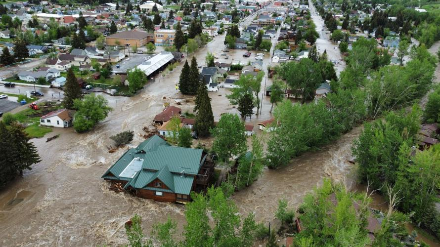

```{r setup, include=FALSE}
knitr::opts_chunk$set(echo=F, message=F, warning=F)
```

## Introduction
The Gallatin River is an important resource for the community of Bozeman, MT. It provides water for irrigation of farming businesses and families. It is a renowned fly fishing destination that brings lots of tourist dollars to the area. Low water and droughts will negatively impact the agriculture and tourism economic sectors. River flows are also an indicator for the filling of local reservoirs with drinking water. It is known that the drinking water supply in Bozeman is quickly shrinking with its growing population. With more growth and more drought, the water supply in this region may be insufficient.

{#id .class width=50% height=50%}
{#id .class width=50% height=50%}
Figure 1: Agriculture and tourism are important industries in Montana.

On the flip side, too much water leads to flooding. We have seen first hand the damage from recent historic flooding. The spring of 2022 saw an above-average snowpack combined with unusually wet months. The community of Red Lodge, MT suffered massive destruction and the road through the north entrance of Yellowstone National Park was totally destroyed from river flooding, shown in Figure 2. Predicting river flow is important to warn our communities of imminent danger.

{#id .class width=50% height=50%}
{#id .class width=50% height=50%}

Figure 2: Photos  of Yellowstone River and tributaries during spring 2022 flood

My research question asks: can I predict the hourly water flow of the Gallatin River using previous water flow measurements and data from three weather stations at various locations upstream measuring snow depth, precipitation accumulation, and temperature?

```{r Format Data Response}
library(tidyverse)
library(lubridate)
library(padr)

# read in raw data
response <- read_csv("nwis_waterservices_usgs_gov.csv", skip=28, col_names=T)

# remove extraneous columns
response <- response %>% 
  select(date, time, timezone, discharge)

# correct for daylight savings time changes (accounts for weird bug too *see below for details)
response <- response %>% 
  mutate(datetime=as_datetime(ifelse(timezone=="MDT",
                                     as.POSIXct(paste(date, time),
                                                format="%Y-%m-%d %H:%M:%S", 
                                                tz="America/Chicago")-6*3600, # minus six hours to match local time (not UTC)
                                     as.POSIXct(paste(date, time), 
                                                format="%Y-%m-%d %H:%M:%S", 
                                                tz="America/Denver")-7*3600))) # minus seven hours (even though I changed the timezone) due to bug: somehow it is automatically changing the timezone (even though I don't think it should know to do this - except a few observations fall through the cracks, I don't know why)
# correct for observations that are somehow skipped by the bug (and need extra adjustment)
nonbug_obs <- c(seq(102,108,by=2),       # 2012
                seq(35045,35051,by=2),   # 2013
                seq(65378,65382,by=2),   # 2014
                seq(97921,97925,by=2),   # 2015
                seq(133436,133442,by=2), # 2016
                seq(168376,168382,by=2), # 2017
                seq(203320,203326,by=2), # 2018
                seq(238258,238260,by=2), # 2019
                seq(273055,273057,by=2), # 2020
                seq(308671,308673,by=2)) # 2021
response$datetime[nonbug_obs] <- response$datetime[nonbug_obs] + 3600 # add an hour to these dates

# thicken to hour, summarize with the mean, and pad
response2 <- response %>% 
  select(discharge, datetime) %>% 
  thicken("hour") %>%
  group_by(datetime_hour) %>%
  summarize(discharge=mean(discharge)) %>%
  pad()

# drop the first row because it starts in the previous day
response2 <- response2[-1,]

# check for missing data
#library(mice)
#md.pattern(response2, rotate.names=T)
md_index <- which(is.na(response2$discharge))
```

## The Data Set
The data set in this project is a compilation of publicly available data from the USGS (https://waterdata.usgs.gov/monitoring-location/06043500/) and SNOTEL websites (https://wcc.sc.egov.usda.gov/reportGenerator/). I downloaded data for water flow of the Gallatin River measured at the mouth of the Gallatin Canyon, shown in Figure 3 as the yellow circle, and weather data collected from three SNOTEL weather stations within the Gallatin River watershed (Carrot Basin, Shower Falls, and Lone Mountain), shown in Figure 3 as red stars.

{#id .class width=70% height=70%}
Figure 3: Map of the Gallatin River watershed with measurement locations for the USGS waterflow sensor (yellow circle) and three SNOTEL weather stations in the mountains (red stars).

An initial look at the raw data set shows that there are significant amounts of missing data for all measurements. Starting with the response variable `discharge`, we see that the missing data occurs in large blocks (a few days or weeks at a time). Figure 4 shows a typical set of missing blocks for one particular year. I imputed these missing values, shown in red, with a Holt-Winters model trained on the data leading up to the missing block. Visually, the imputations look remarkably similar to the existing data. This is not ideal because we will eventually validate the forecasting models with these observations (including the imputations). But given the nature of this data set, it might be the best we can do without entirely removing those observations. Patterns of missingness also occur in the predictor variables. In total I imputed 28,648 values or 3.3% of the data set (1,787 or 2% in the response and 26,861 or 3.4% across the nine predictor variables).

```{r Missing Values Response Plot Imputations}
# use HW model to impute missing values
library(forecast)
imputed_values <- data.frame(datetime_hour=response2$datetime_hour, discharge=rep(NA, length=dim(response2)[1]))
# missing data 1
ts1 <- ts(response2$discharge[8713:9216], start=1, frequency=24)
m1 <- HoltWinters(ts1, alpha=0.01)
fc1 <- predict(m1, n.ahead=480)
imputed_values$discharge[9216] <- response2$discharge[9216]
imputed_values$discharge[9217:9696] <- fc1
imputed_values$discharge[9697] <- response2$discharge[9697]

# missing data 2
ts2 <- ts(response2$discharge[9722:10056], start=1, frequency=24)
m2 <- HoltWinters(ts2, alpha=0.01)
fc2 <- predict(m2, n.ahead=24)
imputed_values$discharge[10056] <- response2$discharge[10056]
imputed_values$discharge[10057:10080] <- fc2
imputed_values$discharge[10081] <- response2$discharge[10081]

# missing data 3
ts3 <- ts(c(response2$discharge[9722:10056],
            fc2,
            response2$discharge[10081:10128]), start=1, frequency=24)
m3 <- HoltWinters(ts3, alpha=0.01)
fc3 <- predict(m3, n.ahead=72)
imputed_values$discharge[10128] <- response2$discharge[10128]
imputed_values$discharge[10129:10200] <- fc3
imputed_values$discharge[10201] <- response2$discharge[10201]

# missing data 4
ts4 <- ts(c(fc2,
            response2$discharge[10081:10128],
            fc3,
            response2$discharge[10201:10464]), start=1, frequency=24)
m4 <- HoltWinters(ts4, alpha=0.01)
fc4 <- predict(m4, n.ahead=96)
imputed_values$discharge[10464] <- response2$discharge[10464]
imputed_values$discharge[10465:10560] <- fc4
imputed_values$discharge[10561] <- response2$discharge[10561]

# missing data 5
ts5 <- ts(response2$discharge[10561:11088], start=1, frequency=24)
m5 <- HoltWinters(ts5, alpha=0.01)
fc5 <- predict(m5, n.ahead=432)
imputed_values$discharge[11088] <- response2$discharge[11088]
imputed_values$discharge[11089:11520] <- fc5
imputed_values$discharge[11521] <- response2$discharge[11521]

# missing data 6
ts6 <- ts(response2$discharge[11521:11616], start=1, frequency=24)
m6 <- HoltWinters(ts6, alpha=0.01)
fc6 <- predict(m6, n.ahead=48)
imputed_values$discharge[11616] <- response2$discharge[11616]
imputed_values$discharge[11617:11664] <- fc6
imputed_values$discharge[11665] <- response2$discharge[11665]

par(mfrow=c(2,1))
plot(response2[8713:12336,], type="l", main="Missing values: Nov 2013 - Mar 2014", xlab="", ylab="discharge (CFS)")
plot(response2[8713:12336,], type="l", main="Imputed values: Nov 2013 - Mar 2014", xlab="", ylab="discharge (CFS)")
lines(imputed_values[8713:12336,], col="red")
```
Figure 4: Large blocks of missing data in the response variable and imputed values in red.

In Figure 5, we can see that there is a lot of redundancy in the three weather measurements from each of the three SNOTEL sites. Having all three weather stations is unnecessary and introduces complications from multicollinearity, so I will choose just the Carrot Basin measurements.

```{r Missing Values Response Continue Code No Plots}
#################################################
# inspect missing values for 2014-2015
#################################################
#par(mfrow=c(2,1))
#plot(response2[17522:26282,], type="l", main="Nov 2014 - Oct 2015", xlab="", ylab="discharge (CFS)")
#abline(v=response2$datetime_hour[17473], col="blue")
#abline(v=response2$datetime_hour[19680], col="blue")
#rect(xleft = response2$datetime_hour[17473],
#     xright = response2$datetime_hour[19680],
#     ybottom = 0,
#     ytop = 8000,
#     col=adjustcolor("cornflowerblue", alpha=0.2))
#plot(response2[17473:19680,], type="l", main="Zoomed in: Nov 2014 - Jan 2015", xlab="", ylab="discharge (CFS)")

# use HW model to impute missing values
# missing data 7
ts7 <- ts(response2$discharge[17473:17688], start=1, frequency=24)
m7 <- HoltWinters(ts7, alpha=0.01)
fc7 <- predict(m7, n.ahead=312)
imputed_values$discharge[17688] <- response2$discharge[17688]
imputed_values$discharge[17688:18000] <- fc7
imputed_values$discharge[18001] <- response2$discharge[18001]

# missing data 8
ts8 <- ts(response2$discharge[18001:18144], start=1, frequency=24)
m8 <- HoltWinters(ts8, alpha=0.9)
fc8 <- predict(m8, n.ahead=96)
imputed_values$discharge[18144] <- response2$discharge[18144]
imputed_values$discharge[18145:18240] <- fc8
imputed_values$discharge[18241] <- response2$discharge[18241]

# missing data 9
ts9 <- ts(response2$discharge[18241:18576], start=1, frequency=24)
m9 <- HoltWinters(ts9, alpha=0.01)
fc9 <- predict(m9, n.ahead=24)
imputed_values$discharge[18576] <- response2$discharge[18576]
imputed_values$discharge[18577:18600] <- fc9
imputed_values$discharge[18601] <- response2$discharge[18601]

# missing data 10
ts10 <- ts(response2$discharge[18601:18840], start=1, frequency=24)
m10 <- HoltWinters(ts10, alpha=0.9)
fc10 <- predict(m10, n.ahead=168)
imputed_values$discharge[18840] <- response2$discharge[18840]
imputed_values$discharge[18841:19008] <- fc10
imputed_values$discharge[19009] <- response2$discharge[19009]

# plot 2014-2015 with imputed values
#par(mfrow=c(2,1))
#plot(response2[17473:26282,], type="l", main="Nov 2014 - Oct 2015", xlab="", ylab="discharge (CFS)")
#lines(imputed_values[17473:26282,], col="red")
#abline(v=response2$datetime_hour[17473], col="blue")
#abline(v=response2$datetime_hour[19680], col="blue")
#rect(xleft = response2$datetime_hour[17473],
#     xright = response2$datetime_hour[19680],
#     ybottom = 0,
#     ytop = 8000,
#     col=adjustcolor("cornflowerblue", alpha=0.2))
#plot(response2[17473:19680,], type="l", main="Zoomed in: Nov 2014 - Jan 2015", xlab="", ylab="discharge (CFS)")
#lines(imputed_values[17473:19680,], col="red")
#
# plot imputing models
#par(mfrow=c(2,2))
#plot(m7, fc7)
#plot(m8, fc8)
#plot(m9, fc9)
#plot(m10, fc10)

#################################################
# inspect missing values for 2015-2016
#################################################
# par(mfrow=c(2,1))
# plot(response2[26283:35043,], type="l", main="Nov 2015 - Oct 2016", xlab="", ylab="discharge (CFS)")
# abline(v=response2$datetime_hour[26233], col="blue")
# abline(v=response2$datetime_hour[26952], col="blue")
# rect(xleft = response2$datetime_hour[26233],
#      xright = response2$datetime_hour[26952],
#      ybottom = 0,
#      ytop = 8000,
#      col=adjustcolor("cornflowerblue", alpha=0.2))
# plot(response2[26233:26952,], type="l", main="Zoomed in: Nov 2015", xlab="", ylab="discharge (CFS)")

# use HW model to impute missing values
# missing data 11
ts11 <- ts(response2$discharge[26233:26760], start=1, frequency=24)
m11 <- HoltWinters(ts11, alpha=0.01)
fc11 <- predict(m11, n.ahead=24)
imputed_values$discharge[26760] <- response2$discharge[26760]
imputed_values$discharge[26761:26784] <- fc11
imputed_values$discharge[26785] <- response2$discharge[26785]

# plot 4th year (2015-2016) with imputed values
# par(mfrow=c(2,1))
# plot(response2[26283:35043,], type="l", main="Nov 2015 - Oct 2016", xlab="", ylab="discharge (CFS)")
# lines(imputed_values[26283:35043,], col="red")
# abline(v=response2$datetime_hour[26233], col="blue")
# abline(v=response2$datetime_hour[26952], col="blue")
# rect(xleft = response2$datetime_hour[26233],
#      xright = response2$datetime_hour[26952],
#      ybottom = 0,
#      ytop = 8000,
#      col=adjustcolor("cornflowerblue", alpha=0.2))
# plot(response2[26233:26952,], type="l", main="Zoomed in: Nov 2015", xlab="", ylab="discharge (CFS)")
# lines(imputed_values[26233:26952,], col="red")
# 
# #plot imputing models
# par(mfrow=c(1,1))
# plot(m11, fc11)

#################################################
# inspect missing values for 2019-2020
#################################################
# par(mfrow=c(2,1))
# plot(response2[61297:70057,], type="l", main="Nov 2015 - Oct 2016", xlab="", ylab="discharge (CFS)")
# abline(v=response2$datetime_hour[65665], col="blue")
# abline(v=response2$datetime_hour[66408], col="blue")
# rect(xleft = response2$datetime_hour[65665],
#      xright = response2$datetime_hour[66408],
#      ybottom = 0,
#      ytop = 8000,
#      col=adjustcolor("cornflowerblue", alpha=0.2))
# plot(response2[65665:66408,], type="l", main="Zoomed in: Nov 2015", xlab="", ylab="discharge (CFS)")

# missing data 12
# fill in every-other missing with the average of the adjacent values
md12 <- seq(66333,66375)
for(i in md12) {
  if(i %% 2 == 1) {imputed_values$discharge[i] <- response2$discharge[i]}
  else {imputed_values$discharge[i] <- mean(c(response2$discharge[i-1],response2$discharge[i+1]))}
}

# plot 2019-202 with imputed values
# par(mfrow=c(2,1))
# plot(response2[61297:70057,], type="l", main="Nov 2019 - Oct 2020", xlab="", ylab="discharge (CFS)")
# lines(imputed_values[61297:70057,], col="red")
# abline(v=response2$datetime_hour[65665], col="blue")
# abline(v=response2$datetime_hour[66408], col="blue")
# rect(xleft = response2$datetime_hour[65665],
#      xright = response2$datetime_hour[66408],
#      ybottom = 0,
#      ytop = 8000,
#      col=adjustcolor("cornflowerblue", alpha=0.2))
# plot(response2[65665:66408,], type="l", main="Zoomed in: May 2020", xlab="", ylab="discharge (CFS)")
# lines(imputed_values[65665:66408,], col="red")

response3 <- response2
for(i in md_index) {response3$discharge[i] <- imputed_values$discharge[i]}
#md.pattern(response3, rotate.names=T)
```

```{r Format Data Predictors}
# read in raw data
vars <- read_csv("snotel_carrot_basin_lone_mtn_shower_falls.csv", skip=59, col_names=T)

# drop the last row to match size (exact dates/times) of response
vars <- vars[-87648,]
```

```{r Missing Values Predictors Plot Missing And Imputations}
# check for missing data
#md.pattern(vars, rotate.names=T)

# function for imputing missing values by finding a missing value at index A+1,
# then moving one step at a time until it finds the first non-NA at index B,
# computes  the step value that will get us from the value at A to the value at B,
# then goes back and fills in the NAs by incrementing the step value,
# essentially imputing with a straight line from A to B
# this does a surprisingly great job on this data set due to the very sporadic
#nature of the missingness
impute_gap <- function(y, maxgap) {
  # store last index of vector y
  end_of_y <- length(y)
  # initialize vector of imputed values
  imputed_values <- rep(NA, length(y))
  # go through every value in sequence
  for(i in 1:length(y)) {
    # if we encounter an NA, then take action
    if(is.na(y[i]) & is.na(imputed_values[i])) {
      # initialize the gap length to 1 since we already found an NA
      count <- 1
      # move forward one step at a time until we reach the first non-NA value
      # (or until we reach the end of the specified maximum gap length)
      for(j in 1:end_of_y) {
        # initialize token indicating within gap length
        within_gap_length <- FALSE
        # count the length of the gap (including the first non-NA value)
        count <- count + 1
        # when we encounter the first non-NA value
        if(!is.na(y[i+j])) {
          if(j<=maxgap) {
            within_gap_length <- TRUE # indicate this is within the gap length
          }
          break # end the for loop
        }
      }
      if(within_gap_length) {
        step_val <- (y[i+j]-y[i-1])/count # compute step value
        # reiterate through the gap, filling in values as we go
        for(step in 1:j) {
          # the next NA value gets the current value plus the step * step value
          val <- y[i-1]+step*step_val
          imputed_values[i+step-1] <- val
        }
      }
      # skip i ahead to the end of the current gap
      i <- i+j
    }
  }
  return(imputed_values)
}

############################################
# working on carrot basin snow depth
############################################
#par(mfrow=c(2,1))
#plot(vars$cb_snow_depth, type="l", main="Carrot Basin", xlab="", ylab="snow depth (in)")
# 1. replace erroneously high values with NAs
md_index <- which(vars$cb_snow_depth > 120)
vars$cb_snow_depth[md_index] <- NA
# 2. replace NAs with imputed values (fit models, make predictions, etc)
md_index <- which(is.na(vars$cb_snow_depth))
# use function on carrot basin snow depth
imputed_values <- impute_gap(vars$cb_snow_depth, 30)
vars$cb_snow_depth[md_index] <- imputed_values[md_index]
# check for more missing data again
md_index <- which(is.na(vars$cb_snow_depth))
# fill in NAs at the end of the vector
vars$cb_snow_depth[md_index] <- 10
#plot(vars$cb_snow_depth, type="l", main="Imputed Values", xlab="", ylab="snow depth (in)")
#points(imputed_values, col="red", pch=16, cex=0.01)
```

```{r Missing Values Vars Continue Code No Plots}
############################################
# working on carrot basin precip acc
############################################
#par(mfrow=c(2,1))
#plot(vars$cb_precip_accum, type="l", main="Carrot Basin", xlab="", ylab="precip acc (in)")
# 1. replace erroneously high values with NAs
md_index <- which(vars$cb_precip_accum > 120)
vars$cb_precip_accum[md_index] <- NA
# 2. replace NAs with imputed values (fit models, make predictions, etc)
md_index <- which(is.na(vars$cb_precip_accum))
# use function on carrot basin snow depth
imputed_values <- impute_gap(vars$cb_precip_accum, 30)
vars$cb_precip_accum[md_index] <- imputed_values[md_index]
# check for more missing data again
md_index <- which(is.na(vars$cb_snow_depth))
#plot(vars$cb_precip_accum, type="l", main="Imputed Values", xlab="", ylab="precip accum (in)")
#points(imputed_values, col="red", pch=16, cex=0.3)

############################################
# working on carrot basin temp
############################################
#par(mfrow=c(2,1))
#plot(vars$cb_temp, type="l", main="Carrot Basin", xlab="", ylab="temp (F)")
# 1. replace NAs with imputed values (fit models, make predictions, etc)
md_index <- which(is.na(vars$cb_temp))
# use function on carrot basin snow depth
imputed_values <- impute_gap(vars$cb_temp, 30)
vars$cb_temp[md_index] <- imputed_values[md_index]
# check for more missing data again
md_index <- which(is.na(vars$cb_snow_depth))
#plot(vars$cb_temp, type="l", main="Imputed Values", xlab="", ylab="temp (F)")
#points(imputed_values, col="red", pch=16, cex=0.3)

############################################
# working on lone mountain snow depth
############################################
#par(mfrow=c(2,1))
#plot(vars$lm_snow_depth, type="l", main="Lone Mountain", xlab="", ylab="snow depth (in)")
# 1. replace NAs with imputed values (fit models, make predictions, etc)
md_index <- which(is.na(vars$lm_snow_depth))
# use function on carrot basin snow depth
imputed_values <- impute_gap(vars$lm_snow_depth, 30)
vars$lm_snow_depth[md_index] <- imputed_values[md_index]
# check for more missing data again
md_index <- which(is.na(vars$cb_snow_depth))
#plot(vars$lm_snow_depth, type="l", main="Imputed Values", xlab="", ylab="snow depth (in)")
#points(imputed_values, col="red", pch=16, cex=0.3)

############################################
# working on lone mountain precip acc
############################################
#par(mfrow=c(2,1))
#plot(vars$lm_precip_accum, type="l", main="Lone Mountain", xlab="", ylab="precip acc (in)")
# 1. replace NAs with imputed values (fit models, make predictions, etc)
md_index <- which(is.na(vars$lm_precip_accum))
# use function on carrot basin snow depth
imputed_values <- impute_gap(vars$lm_precip_accum, 30)
vars$lm_precip_accum[md_index] <- imputed_values[md_index]
# check for more missing data again
md_index <- which(is.na(vars$lm_precip_accum))
#plot(vars$lm_precip_accum, type="l", main="Imputed Values", xlab="", ylab="precip accum (in)")
#points(imputed_values, col="red", pch=16, cex=0.3)

############################################
# working on lone mountain temp
############################################
#par(mfrow=c(2,1))
#plot(vars$lm_temp, type="l", main="Lone Mountain", xlab="", ylab="temp (F)")
# 1. replace NAs with imputed values (fit models, make predictions, etc)
md_index <- which(is.na(vars$lm_temp))
# use function on carrot basin snow depth
imputed_values <- impute_gap(vars$lm_temp, 30)
vars$lm_temp[md_index] <- imputed_values[md_index]
# check for more missing data again
md_index <- which(is.na(vars$lm_temp))
#plot(vars$lm_temp, type="l", main="Imputed Values", xlab="", ylab="temp (F)")
#points(imputed_values, col="red", pch=16, cex=0.3)

############################################
# working on shower falls snow depth
############################################
#par(mfrow=c(2,1))
#plot(vars$sf_snow_depth, type="l", main="Shower Falls", xlab="", ylab="snow depth (in)")
# 1. replace NAs with imputed values (fit models, make predictions, etc)
md_index <- which(is.na(vars$sf_snow_depth))
# use function on carrot basin snow depth
imputed_values <- impute_gap(vars$sf_snow_depth, 30)
vars$sf_snow_depth[md_index] <- imputed_values[md_index]
# check for more missing data again
md_index <- which(is.na(vars$sf_snow_depth))
# fill in NAs at the end of the vector
vars$sf_snow_depth[md_index] <- 8
#plot(vars$sf_snow_depth, type="l", main="Imputed Values", xlab="", ylab="snow depth (in)")
#points(imputed_values, col="red", pch=16, cex=0.3)

############################################
# working on shower falls precip acc
############################################
#par(mfrow=c(2,1))
#plot(vars$sf_precip_accum, type="l", main="Shower Falls", xlab="", ylab="precip acc (in)")
# 1. replace NAs with imputed values (fit models, make predictions, etc)
md_index <- which(is.na(vars$sf_precip_accum))
# use function on carrot basin snow depth
imputed_values <- impute_gap(vars$sf_precip_accum, 30)
vars$sf_precip_accum[md_index] <- imputed_values[md_index]
# check for more missing data again
md_index <- which(is.na(vars$sf_precip_accum))
#plot(vars$sf_precip_accum, type="l", main="Imputed Values", xlab="", ylab="precip accum (in)")
#points(imputed_values, col="red", pch=16, cex=0.3)

############################################
# working on shower falls temp
############################################
#par(mfrow=c(2,1))
#plot(vars$sf_temp, type="l", main="Shower Falls", xlab="", ylab="temp (F)")
# 1. replace NAs with imputed values (fit models, make predictions, etc)
md_index <- which(is.na(vars$sf_temp))
# use function on carrot basin snow depth
imputed_values <- impute_gap(vars$sf_temp, 30)
vars$sf_temp[md_index] <- imputed_values[md_index]
# check for more missing data again
md_index <- which(is.na(vars$sf_temp))
#plot(vars$sf_temp, type="l", main="Imputed Values", xlab="", ylab="temp (F)")
#points(imputed_values, col="red", pch=16, cex=0.3)

# check for missing data
#md.pattern(vars, rotate.names=T)

# create one big matrix
discharge <- response3$discharge
gallatin <- cbind(vars, discharge)
# add one more row (repeat previous row) because I didn't collect the
# right number of rows (due to time change issues)
gallatin[(dim(gallatin)+1)[1],] <- gallatin[(dim(gallatin))[1],]
```

```{r Use All Hourly Measurements, echo=F, warning=F, message=F}
# calculate the difference in precipitation accumulation (accounting for zero-reset on Oct 01 every year)
w <- 48 # window (in hrs) of precip accumulation
precip_w <- c(rep(0, w-1),
              rep(NA, length(gallatin$date)-w+1))
precip_diff <- c(0.0,
                 diff(gallatin$cb_precip_accum[1:which(gallatin$date == "2013-10-01 00:00:00 UTC")]),
                 gallatin$cb_precip_accum[which(gallatin$date == "2013-10-01 00:00:00 UTC")+1],
                 diff(gallatin$cb_precip_accum[(which(gallatin$date == "2013-10-01 00:00:00 UTC")+1):which(gallatin$date == "2014-10-01 00:00:00 UTC")]),
                 gallatin$cb_precip_accum[which(gallatin$date == "2014-10-01 00:00:00 UTC")+1],
                 diff(gallatin$cb_precip_accum[(which(gallatin$date == "2014-10-01 00:00:00 UTC")+1):which(gallatin$date == "2015-10-01 00:00:00 UTC")]),
                 gallatin$cb_precip_accum[which(gallatin$date == "2015-10-01 00:00:00 UTC")+1],
                 diff(gallatin$cb_precip_accum[(which(gallatin$date == "2015-10-01 00:00:00 UTC")+1):which(gallatin$date == "2016-10-01 00:00:00 UTC")]),
                 gallatin$cb_precip_accum[which(gallatin$date == "2016-10-01 00:00:00 UTC")+1],
                 diff(gallatin$cb_precip_accum[(which(gallatin$date == "2016-10-01 00:00:00 UTC")+1):which(gallatin$date == "2017-10-01 00:00:00 UTC")]),
                 gallatin$cb_precip_accum[which(gallatin$date == "2017-10-01 00:00:00 UTC")+1],
                 diff(gallatin$cb_precip_accum[(which(gallatin$date == "2017-10-01 00:00:00 UTC")+1):which(gallatin$date == "2018-10-01 00:00:00 UTC")]),
                 gallatin$cb_precip_accum[which(gallatin$date == "2018-10-01 00:00:00 UTC")+1],
                 diff(gallatin$cb_precip_accum[(which(gallatin$date == "2018-10-01 00:00:00 UTC")+1):which(gallatin$date == "2019-10-01 00:00:00 UTC")]),
                 gallatin$cb_precip_accum[which(gallatin$date == "2019-10-01 00:00:00 UTC")+1],
                 diff(gallatin$cb_precip_accum[(which(gallatin$date == "2019-10-01 00:00:00 UTC")+1):which(gallatin$date == "2020-10-01 00:00:00 UTC")]),
                 gallatin$cb_precip_accum[which(gallatin$date == "2020-10-01 00:00:00 UTC")+1],
                 diff(gallatin$cb_precip_accum[(which(gallatin$date == "2020-10-01 00:00:00 UTC")+1):which(gallatin$date == "2021-10-01 00:00:00 UTC")]),
                 gallatin$cb_precip_accum[which(gallatin$date == "2021-10-01 00:00:00 UTC")+1],
                 diff(gallatin$cb_precip_accum[(which(gallatin$date == "2021-10-01 00:00:00 UTC")+1):which(gallatin$date == "2022-10-01 00:00:00 UTC")]),
                 gallatin$cb_precip_accum[which(gallatin$date == "2022-10-01 00:00:00 UTC")+1],
                 diff(gallatin$cb_precip_accum[(which(gallatin$date == "2022-10-01 00:00:00 UTC")+1):nrow(gallatin)]))

# calculate the precip accumulation for the specified window
for(i in w:length(precip_diff)){
  precip_w[i] <- sum(precip_diff[(i-w+1):i])
}

# compile all these variables into one master data frame
cb2 <- data.frame(date = gallatin$date,
                  temp = gallatin$cb_temp,
                  precip_accum = precip_w,
                  snow_depth = gallatin$cb_snow_depth,
                  discharge = gallatin$discharge)
```

```{r Plot Precip Accum for Feature Engineering}
# look at precip accumulation feature engineering
#zoom1 <- 8760*7
#zoom1 <- 1
#zoom2 <- 8760*8
#zoom2 <- length(cb2$date)
#plot(cb2$date[zoom1:zoom2], scale(cb2$discharge[zoom1:zoom2]), type="l", col="blue")
#lines(cb2$date[zoom1:zoom2], cb2$precip_w[zoom1:zoom2], col="black")
```

```{r Adjust Extreme Values}
extreme_precip <- 2
extreme_snow <- 30
for(i in 2:(dim(cb2)[1])){
  # deal with extreme steps in precip_w
  if(abs(cb2$precip_accum[i]) > extreme_precip){
    #cat("precip: ", cb2$precip_accum[i], " at ", i, "\n")
    cb2$precip_accum[i] <- cb2$precip_accum[i-1]
  }
  # deal with extreme steps in snow_depth
  diff_snow_depth <- cb2$snow_depth[i] - cb2$snow_depth[i-1]
  if(abs(diff_snow_depth) > extreme_snow){
    #cat("snow depth: ", diff_snow_depth, " at ", i, "\n")
    cb2$snow_depth[i] <- cb2$snow_depth[i-1]
  }
}
```

```{r Comparing predictors across stations}
par(mfrow=c(3,1),
    mar=c(2,2,2,2), # bottom, left, top, right
    oma=c(2,2,2,2),
    mgp=c(2,1,0),
    xpd=NA)

plot(gallatin$date[1417:10177], gallatin$cb_temp[1417:10177], type="l", col="red", main="Temperature, precipitation accumulation, and snow depth across SNOTEL stations", ylab="temperature (C)", xlab="")
lines(gallatin$date[1417:10177], gallatin$lm_temp[1417:10177], col="blue")
lines(gallatin$date[1417:10177], gallatin$sf_temp[1417:10177], col="darkgreen")
legend("topright", legend=c("Carrot Basin", "Lone Mountain", "Shower Falls"),col=c("red", "blue", "darkgreen"), pch=15, cex=0.5)

plot(gallatin$date, gallatin$cb_precip_accum, type="l", col="red", ylab="precip accum (in)", xlab="")
lines(gallatin$date, gallatin$lm_precip_accum, col="blue")
lines(gallatin$date, gallatin$sf_precip_accum, col="darkgreen")

plot(gallatin$date, gallatin$cb_snow_depth, type="l", col="red", ylab="snow depth (in)", xlab="")
lines(gallatin$date, gallatin$lm_snow_depth, col="blue")
lines(gallatin$date, gallatin$sf_snow_depth, col="darkgreen")
```
Figure 5: Comparing predictors across the different SNOTEL stations.

After all the cleaning described so far, the data set in its final form includes the following variables: (1) the date and time of the measurements, (2) air temperature in degrees Celsius at Carrot Basin, (3) precipitation accumulation from the past 48 hours in inches at Carrot Basin, (4) snow depth in inches at Carrot Basin, and (5) water discharge in cubic feet per second of the Gallatin River. I collected 10 years of hourly data for all measurements from 2012-11-03 00:00:00 PDT to 2022-11-02 00:00:00 PDT. In total, there are 87,648 observations and 5 variables.

## Exploratory Data Analysis
Figure 6 shows a time series plot of all five variables through a typical year (note: the values are scaled to show relationships among variables). This is a visual check for any obvious correlation between the predictors and the response. We can see that precipitation accumulation is positively correlated and snow depth is negatively correlated with discharge. If temperature has any correlation with discharge, it is weak. There also appears to be some correlation among the predictors: temperature and snow depth are negatively correlated, while precipitation accumulation and snow depth are positively correlated. As a final exploratory check, we look at any potential autocorrelation. Figure 7 shows the ACF and PACF plots of the residuals from a mean-only model. The ACF plot shows definite autocorrelation, while the PACF indicates that maybe an AR(2) model is appropriate with some seasonal components.

```{r, EDA Plot Time Series}
# plot time series
t_start <- 1441+8760*6
t_stop <- 1441+8760*7
plot(cb2$date[t_start:t_stop], scale(cb2$discharge[t_start:t_stop], center=F), type="l", main="Time series of all variables for 2019", col=alpha("black",1), xlab="Time", ylab="Scaled Value", ylim=c(-0.6,5))
lines(cb2$date[t_start:t_stop], scale(cb2$temp[t_start:t_stop], center=F), lwd=0.25, col=alpha("red",0.35))
lines(cb2$date[t_start:t_stop], cb2$precip_accum[t_start:t_stop], lwd=0.25, col=alpha("blue",0.5))
lines(cb2$date[t_start:t_stop], scale(cb2$snow_depth[t_start:t_stop], center=F), col=alpha("darkgreen",0.75))
legend("topright", legend=c("discharge", "precip accum", "temperature","snow depth"), col=c("black", "blue", "red", "darkgreen"), pch=15)
```
Figure 6: Plot of time series for all variables through a typical year (note: the values are scaled to show relationships among variables).

```{r, EDA Plot ACF PACF, fig.height=3}
library(nlme)
# acf pacf
m_for_acf <- gls(discharge ~ 1, data=cb2)
r <- residuals(m_for_acf, type="normalized")
ACF <- acf(r, plot=F, lag.max=48)
PACF <- pacf(r, plot=F,lag.max=48)
plot(ACF, main="")
plot(PACF, main="")
```
Figure 7: ACF and PACF plots of the residuals from a mean-only model.


```{r, Run all models and validate, eval=F}
# initialize necessary variables
n.train <- 10*24 # training data for x days * 24 hrs
n.shift <- 24 # testing data predict x hrs in future
n.iter <- floor((length(cb2$discharge)-n.train)/n.shift)-1 # number of iterations

# initialize arrays to store important values for each iteration
index <- rep(NA, n.iter)
arma <- data.frame(arima1p=rep(NA, n.shift*n.iter),
                   arima1d=rep(NA, n.shift*n.iter),
                   arima1q=rep(NA, n.shift*n.iter),
                   arima2p=rep(NA, n.shift*n.iter),
                   arima2d=rep(NA, n.shift*n.iter),
                   arima2q=rep(NA, n.shift*n.iter),
                   arima3p=rep(NA, n.shift*n.iter),
                   arima3d=rep(NA, n.shift*n.iter),
                   arima3q=rep(NA, n.shift*n.iter),
                   arima4p=rep(NA, n.shift*n.iter),
                   arima4d=rep(NA, n.shift*n.iter),
                   arima4q=rep(NA, n.shift*n.iter),
                   arima23p=rep(NA, n.shift*n.iter),
                   arima23d=rep(NA, n.shift*n.iter),
                   arima23q=rep(NA, n.shift*n.iter),
                   arima24p=rep(NA, n.shift*n.iter),
                   arima24d=rep(NA, n.shift*n.iter),
                   arima24q=rep(NA, n.shift*n.iter),
                   arima34p=rep(NA, n.shift*n.iter),
                   arima34d=rep(NA, n.shift*n.iter),
                   arima34q=rep(NA, n.shift*n.iter),
                   arima234p=rep(NA, n.shift*n.iter),
                   arima234d=rep(NA, n.shift*n.iter),
                   arima234q=rep(NA, n.shift*n.iter))

predictions <- data.frame(mean=rep(NA, n.shift*n.iter),
                          hw10=rep(NA, n.shift*n.iter),
                          hw25=rep(NA, n.shift*n.iter),
                          hw50=rep(NA, n.shift*n.iter),
                          hw75=rep(NA, n.shift*n.iter),
                          hw90=rep(NA, n.shift*n.iter),
                          arima1=rep(NA, n.shift*n.iter),
                          arima2=rep(NA, n.shift*n.iter),
                          arima3=rep(NA, n.shift*n.iter),
                          arima4=rep(NA, n.shift*n.iter),
                          arima23=rep(NA, n.shift*n.iter),
                          arima24=rep(NA, n.shift*n.iter),
                          arima34=rep(NA, n.shift*n.iter),
                          arima234=rep(NA, n.shift*n.iter))

error <- data.frame(mean=rep(NA, n.shift*n.iter),
                    hw10=rep(NA, n.shift*n.iter),
                    hw25=rep(NA, n.shift*n.iter),
                    hw50=rep(NA, n.shift*n.iter),
                    hw75=rep(NA, n.shift*n.iter),
                    hw90=rep(NA, n.shift*n.iter),
                    arima1=rep(NA, n.shift*n.iter),
                    arima2=rep(NA, n.shift*n.iter),
                    arima3=rep(NA, n.shift*n.iter),
                    arima4=rep(NA, n.shift*n.iter),
                    arima23=rep(NA, n.shift*n.iter),
                    arima24=rep(NA, n.shift*n.iter),
                    arima34=rep(NA, n.shift*n.iter),
                    arima234=rep(NA, n.shift*n.iter))

for(i in 0:n.iter) {
  # display log
  cat(i,'/',n.iter,'\n')
  # train-test split
  n.start <- 1+i*n.shift
  train <- cb2[(n.start):(n.start-1+n.train),] # train split
  train_ts <- ts(train$discharge, frequency=24) # convert train set into time series class
  test <- cb2[(n.start+n.train):(n.start+n.train+n.shift-1),] # test split
  
  # build mean-only model
  m_mean <- gls(discharge ~ 1, data=train)
  fc_mean <- rep(m_mean$coefficients, n.shift)
  error$mean[(i*n.shift+1):((i+1)*n.shift)] <- fc_mean - test$discharge
  
  # build Holt-Winters models
  m_hw10 <- HoltWinters(train_ts, beta=F, gamma=T, alpha=0.10)
  m_hw25 <- HoltWinters(train_ts, beta=F, gamma=T, alpha=0.25)
  m_hw50 <- HoltWinters(train_ts, beta=F, gamma=T, alpha=0.50)
  m_hw75 <- HoltWinters(train_ts, beta=F, gamma=T, alpha=0.75)
  m_hw90 <- HoltWinters(train_ts, beta=F, gamma=T, alpha=0.90)
  # forecast Holt-Winters models
  fc_hw10 <- predict(m_hw10, n.ahead=n.shift, prediction.interval=T)
  fc_hw25 <- predict(m_hw25, n.ahead=n.shift, prediction.interval=T)
  fc_hw50 <- predict(m_hw50, n.ahead=n.shift, prediction.interval=T)
  fc_hw75 <- predict(m_hw75, n.ahead=n.shift, prediction.interval=T)
  fc_hw90 <- predict(m_hw90, n.ahead=n.shift, prediction.interval=T)
  # calculate error for Holt-Winters models
  error$hw10[(i*n.shift+1):((i+1)*n.shift)] <- as.numeric(fc_hw10[,1]) - test$discharge
  error$hw25[(i*n.shift+1):((i+1)*n.shift)] <- as.numeric(fc_hw25[,1]) - test$discharge
  error$hw50[(i*n.shift+1):((i+1)*n.shift)] <- as.numeric(fc_hw50[,1]) - test$discharge
  error$hw75[(i*n.shift+1):((i+1)*n.shift)] <- as.numeric(fc_hw75[,1]) - test$discharge
  error$hw90[(i*n.shift+1):((i+1)*n.shift)] <- as.numeric(fc_hw90[,1]) - test$discharge

  # build Arima models (one-predictor)
  m_arima1 <- auto.arima(train$discharge)
  m_arima2 <- auto.arima(train$discharge, xreg=cbind(train$temp))
  m_arima3 <- auto.arima(train$discharge, xreg=cbind(train$precip_accum))
  m_arima4 <- auto.arima(train$discharge, xreg=cbind(train$snow_depth))
  # store the ARIMA model order
  arma$arima1p[i+1] <- arimaorder(m_arima1)[1]
  arma$arima1d[i+1] <- arimaorder(m_arima1)[2]
  arma$arima1q[i+1] <- arimaorder(m_arima1)[3]
  arma$arima2p[i+1] <- arimaorder(m_arima2)[1]
  arma$arima2d[i+1] <- arimaorder(m_arima2)[2]
  arma$arima2q[i+1] <- arimaorder(m_arima2)[3]
  arma$arima3p[i+1] <- arimaorder(m_arima3)[1]
  arma$arima3d[i+1] <- arimaorder(m_arima3)[2]
  arma$arima3q[i+1] <- arimaorder(m_arima3)[3]
  arma$arima4p[i+1] <- arimaorder(m_arima4)[1]
  arma$arima4d[i+1] <- arimaorder(m_arima4)[2]
  arma$arima4q[i+1] <- arimaorder(m_arima4)[3]
  # forecast Arima models (one-predictor)
  fc_arima1 <- forecast(m_arima1, h=n.shift)
  fc_arima2 <- forecast(m_arima2, h=n.shift, xreg=cbind(test[,2]))
  fc_arima3 <- forecast(m_arima3, h=n.shift, xreg=cbind(test[,3]))
  fc_arima4 <- forecast(m_arima4, h=n.shift, xreg=cbind(test[,4]))
  # calculate rmse for Arima models (one-predictor)
  error$arima1[(i*n.shift+1):((i+1)*n.shift)] <- fc_arima1$mean - test$discharge
  error$arima2[(i*n.shift+1):((i+1)*n.shift)] <- fc_arima2$mean - test$discharge
  error$arima3[(i*n.shift+1):((i+1)*n.shift)] <- fc_arima3$mean - test$discharge
  error$arima4[(i*n.shift+1):((i+1)*n.shift)] <- fc_arima4$mean - test$discharge
  
  # build Arima models (multiple-predictors)
  if(n.train > 72) {
    m_arima23 <- auto.arima(train$discharge, xreg=cbind(train$temp, train$precip_accum))
    m_arima24 <- auto.arima(train$discharge, xreg=cbind(train$temp, train$snow_depth))
    m_arima34 <- auto.arima(train$discharge, xreg=cbind(train$precip_accum, train$snow_depth))
    m_arima234 <- auto.arima(train$discharge, xreg=cbind(train$temp, train$precip_accum, train$snow_depth))
    # store the ARIMA model order
    arma$arima23p[i+1] <- arimaorder(m_arima23)[1]
    arma$arima23d[i+1] <- arimaorder(m_arima23)[2]
    arma$arima23q[i+1] <- arimaorder(m_arima23)[3]
    arma$arima24p[i+1] <- arimaorder(m_arima24)[1]
    arma$arima24d[i+1] <- arimaorder(m_arima24)[2]
    arma$arima24q[i+1] <- arimaorder(m_arima24)[3]
    arma$arima34p[i+1] <- arimaorder(m_arima34)[1]
    arma$arima34d[i+1] <- arimaorder(m_arima34)[2]
    arma$arima34q[i+1] <- arimaorder(m_arima34)[3]
    arma$arima234p[i+1] <- arimaorder(m_arima234)[1]
    arma$arima234d[i+1] <- arimaorder(m_arima234)[2]
    arma$arima234q[i+1] <- arimaorder(m_arima234)[3]
    # forecast Arima models (multiple-predictor)
    fc_arima23 <- forecast(m_arima23, h=n.shift, xreg=as.matrix(test[,c(2,3)]))
    fc_arima24 <- forecast(m_arima24, h=n.shift, xreg=as.matrix(test[,c(2,4)]))
    fc_arima34 <- forecast(m_arima34, h=n.shift, xreg=as.matrix(test[,c(3,4)]))
    fc_arima234 <- forecast(m_arima234, h=n.shift, xreg=as.matrix(test[,c(2,3,4)]))
    # calculate rmse for Arima models
    error$arima23[(i*n.shift+1):((i+1)*n.shift)] <- fc_arima23$mean - test$discharge
    error$arima24[(i*n.shift+1):((i+1)*n.shift)] <- fc_arima24$mean - test$discharge
    error$arima34[(i*n.shift+1):((i+1)*n.shift)] <- fc_arima34$mean - test$discharge
    error$arima234[(i*n.shift+1):((i+1)*n.shift)] <- fc_arima234$mean - test$discharge
    # store predictions
    predictions$arima23[(i*n.shift+1):((i+1)*n.shift)] <- fc_arima23$mean
    predictions$arima24[(i*n.shift+1):((i+1)*n.shift)] <- fc_arima24$mean
    predictions$arima34[(i*n.shift+1):((i+1)*n.shift)] <- fc_arima34$mean
    predictions$arima234[(i*n.shift+1):((i+1)*n.shift)] <- fc_arima234$mean
  }
  
  # store predictions
  predictions$mean[(i*n.shift+1):((i+1)*n.shift)] <- fc_mean
  predictions$hw10[(i*n.shift+1):((i+1)*n.shift)] <- fc_hw10[,1]
  predictions$hw25[(i*n.shift+1):((i+1)*n.shift)] <- fc_hw25[,1]
  predictions$hw50[(i*n.shift+1):((i+1)*n.shift)] <- fc_hw50[,1]
  predictions$hw75[(i*n.shift+1):((i+1)*n.shift)] <- fc_hw75[,1]
  predictions$hw90[(i*n.shift+1):((i+1)*n.shift)] <- fc_hw90[,1]
  predictions$arima1[(i*n.shift+1):((i+1)*n.shift)] <- fc_arima1$mean
  predictions$arima2[(i*n.shift+1):((i+1)*n.shift)] <- fc_arima2$mean
  predictions$arima3[(i*n.shift+1):((i+1)*n.shift)] <- fc_arima3$mean
  predictions$arima4[(i*n.shift+1):((i+1)*n.shift)] <- fc_arima4$mean
  
  # store dates
  index[i+1] <- n.start + n.train
  # increment iterator
  i <- i + 1
}

# initialize necessary variables
n.train <- 10*24 # training data for x days * 24 hrs
n.shift <- 24 # testing data predict x hrs in future
n.iter <- floor((length(cb2$discharge)-n.train)/n.shift)-1 # number of iterations

# initialize arrays to store important values for each iteration
index <- rep(NA, n.iter)

for(i in 0:n.iter) {
  n.start <- 1+i*n.shift
  # store dates
  index[i+1] <- n.start + n.train
  # increment iterator
  i <- i + 1
}
```

```{r, Save results to RDS, eval=F}
saveRDS(arma, "arma.rds")
saveRDS(predictions, "predictions.rds")
saveRDS(error, "error.rds")
saveRDS(index, "index.rds")
```

```{r, Load results from RDS}
# read in stored modeling data
predictions <- readRDS("predictions.rds")
error <- readRDS("error.rds")

# initialize necessary variables
n.train <- 10*24 # training data for x days * 24 hrs
n.shift <- 24 # testing data predict x hrs in future
n.iter <- floor((length(cb2$discharge)-n.train)/n.shift)-1 # number of iterations

# initialize arrays to store important values for each iteration
index <- rep(NA, n.iter)

for(i in 0:n.iter) {
  n.start <- 1+i*n.shift
  # store dates
  index[i+1] <- n.start + n.train
  # increment iterator
  i <- i + 1
}
# calculate average rmse scores for all models across all iterations
rmse_scores <- data.frame(model=c('mean',
                                  'hw10',
                                  'hw25',
                                  'hw50',
                                  'hw75',
                                  'hw90',
                                  'arima1',
                                  'arima2',
                                  'arima3',
                                  'arima4',
                                  'arima23',
                                  'arima24',
                                  'arima34',
                                  'arima234'),
                          score=sqrt(colMeans(error[-15]^2)))
```

```{r Store errors and predictions}
library(ggplot2)
library(RColorBrewer)

sq_error <- error[-15]^2

error_long <- pivot_longer(data=error,
                          everything(),
                          cols_vary="slowest")
sq_error_long <- pivot_longer(data=sq_error,
                          everything(),
                          cols_vary="slowest")
# append date onto errors
error$date <- cb2$date[index[1]:(index[1]+length(error$mean)-1)]

#predictions$date <- cb2$date[(n.train+1):(length(cb2$date)-n.shift)]
predictions_long <- pivot_longer(data=predictions,
                                   everything(),
                                   cols_vary = "slowest")
predictions_long$date <- rep(cb2$date[(n.train+1):(length(cb2$date)-n.shift)],
                             14)
actual <- data.frame(name=rep("actual",87384),
                     value=cb2$discharge[(n.train+1):(length(cb2$date)-n.shift)],
                     date=cb2$date[(n.train+1):(length(cb2$date)-n.shift)])
predictions_long <- rbind(predictions_long, actual)
```

## Methods
In this analysis I compare various Holt-Winters and ARIMA models, where a mean-only model is the benchmark. The Holt-Winters models are exponentially weighted moving averages with a tuning parameter $\alpha$ that controls the amount of smoothing. I implement a basic grid search for $\alpha\in\{0.1,0.25,0.5,0.75,0.9\}$ with smaller values corresponding to more smoothing, less weight on the last observed value, and larger values corresponding to less smoothing, more weight on the last observed value. The ARIMA models can have auto-regressive (AR), differencing (I), and/or moving average (MA) components. I'm fitting eight ARIMA models, one for every possible combination of my three covariates shown in Table 1. I let the `auto.arima()` function fit the best model each time. RMSE is used as the loss function for all models.

```{r Table ARIMA model key}
library(knitr)
arima_model_key <- data.frame(name=c("arima1","arima2","arima3","arima4","arima23","arima24","arima34","arima234"),
                              covariates=c("none","temp","precip accum","snow depth","temp + precip accum", "temp + snow depth", "precip accum + snow depth", "temp + precip accum + snow depth"))
kable(arima_model_key)
```
Table 1: ARIMA model name key

After a few initial designs for cross-validation, I decided on the following. I will train each model on 10 consecutive days worth of data (240 observations) and test on the 11th day's data (24 observations). The cross-validation loop will step through all 10 years worth of data one day at a time such that I have test predictions for every day (excluding the very first 10 days in the data set). I chose 10 days of training data because more is too slow and less pushes the boundary of not enough data points for the 2 and 3 covariate ARIMA models. I chose 1 day ahead of prediction because it seems to be a fairly practical amount for this analysis. Other cross-validation setups could be the focus of future work (eg. less training data using only Holt-Winters models or expanding to further ahead forecasting).

## Results
After training all the models, I computed the RMSE over all 10 years worth of data, shown in Table 2. It is clear that all the models significantly out-perform the benchmark mean-only model. The RMSE for these models is roughly between 100 and 150 cubic feet per second. Considering that the median water flow is around 400 cfs, the average is around 800 cfs, and the max is 8,600 cfs, the performance of all the models is fairly good.

```{r Table RMSE scores}
kable(rmse_scores)
```
Table 2: RMSE scores for all models

Choosing the best overall model is less straight-forward. Within the Holt-Winters class of models, setting $\alpha=0.75$ achieves the lowest RMSE (even compared to all ARIMA models). Within the ARIMA class, the model with temperature and snow depth as covariates achieved the lowest RMSE (negligibly better than the model with all three covariates). The no-covariate ARIMA model performed the worst. The best single-covariate ARIMA model uses temperature. The best two-covariate ARIMA model uses temperature and snow depth. Viewing this from a step-wise selection perspective, we can see that temperature is the most informative covariate, followed by snow depth and precipitation accumulation. This makes sense because hot temps would melt more snow and be associated with higher water flow, until the snow depth reaches zero of course. Cold temps would be associate with lower water flow since less (or if below freezing: zero) snow is being melted into runoff. Since precipitation accumulation includes rain and snow, high precipitation does not always translate to higher water flow if the precipitation is snow (temps are below freezing). This points to including interaction terms, which could be the focus of future work. But with these models, the Holt-Winters with $\alpha=0.75$ is the best. Figure 10 shows boxplots for all models errors.

```{r Results boxplots, fig.height=4}
#summary(error)

ggplot(data=error_long, aes(x=value, y=name)) +
  geom_boxplot(outlier.shape=19, outlier.alpha=0, outlier.size=0.5) +
  coord_cartesian(xlim=c(-120,150)) +
  ggtitle("Boxplot of raw errors for all models (zoomed in)")

ggplot(data=error_long, aes(x=value, y=name)) +
  geom_boxplot(outlier.shape=19, outlier.alpha=0.2, outlier.size=0.5) +
  ggtitle("Boxplot of raw errors for all models, with outliers (zoomed out)")
```
Figure 10: Boxplots of all model errors

## Discussion
In the end, the models were quite successful. All of the Holt-Winters models out-performed all ARIMA models. Holt-Winters models use no covariates, which allows for smaller training sets. I want to try smaller-sized training batches (note: this would exclude ARIMA models with covariates), recall I used 10 days of training data for this analysis. It would be interesting to compare the performance of these smaller-sized training sets. Maybe there is an ideal size when predicting with Holt-Winters models on this data. These small batch training models might be quick and effective to deploy as a real-time forecasting tool. The ARIMA models seem to require interaction terms to be most effective. It would be interesting to see if including interaction terms to the ARIMA models would allow them to out-perform the Holt-Winters models. As future work, I would like to implement a script that scrapes recent water flow and weather data and makes a real-time forecast.